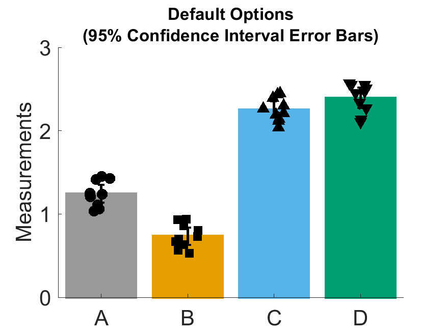
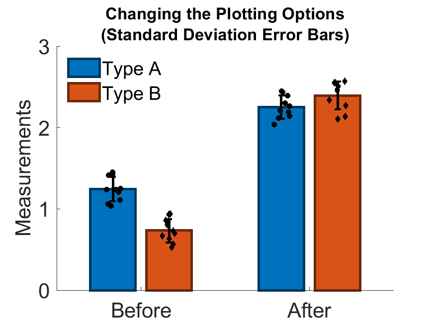

# scatterErrorBarPlot
This is a MATLAB function for making bar plots that show the underlying data points as well as error bars.  Bars in the plot show the mean of the data points, while the error bars show 95% confidence intervals on the mean (or other error bar types as chosen in the plotting options).  I've used variations on this type of plot for a variety of projects, and I decided to pull together the options into a flexible function for simpler use in the future.  The example plots below describe the options for various type of error bars and other features of the plot.  These example plots were made using the included `examplePlots.m` script.

## Dependencies
This function was tested in MATLAB 2019a.  Plotting options might work differently in other versions of MATLAB.

## Acknowledgements
The design of the plots was partially inspired by notBoxPlot by Rob Campbell.  The scatterErrorBarPlot function similarly aims to show the underlying data, but in a design format that is similar to figures often used in bioscience publications.
> Rob Campbell (2020). notBoxPlot (https://github.com/raacampbell/notBoxPlot), GitHub. Retrieved July 26, 2020.

The default colors used by the plotting function are intended to be accessible for colorblind readers.  They are based on a colormap proposed in the Points of View column from Nature Methods.
> Wong, Bang. “Points of View: Color Blindness.” Nature Methods 8, no. 6 (June 2011): 441–441. https://doi.org/10.1038/nmeth.1618.

## Default Plotting Options
The default options for this function produce a plot with 95% confidence interval error bars.  For an m x n input matrix,`A`, there are n bars that each have m scattered data points. The default colormap will make each of the first eight bars a different color, at which point the colors will repeat.  The symbols for each data point cycle through the MATLAB markers `'o','s','^','v','d'` and are size 10.

## Description of Plotting Options
The function usage is `scatterErrorBarPlot(A,errorType,cmap,marker_size,marker_order,cmap_edge)`. All inputs besides the data matrix `A` are optional.  Values can be skipped using [], e.g. `scatterErrorBarPlot(A,[],cmap)`, in which case the default options will be used.

### A
`A` is the matrix of data to be plotted.  An m x n matrix will result in n bars with m data points.  NaN values are ignored; this can be used to create gaps between bars to group data types (see example plot below).

### errorType
In addition to the default 95% confidence interval error bars (`'95CI'`), standard deviation (`'STD'`) and standard error of the mean (`'SEM'`) error bars can be used as the `errorType`.  All three of the options can also be corrected for ratio measurements by calculating the intervals in log space (`'STDratio', 'SEMratio','95CIratio'`).

### cmap
A custom b x 3 matrix of rgb colors can be used for the bar face colors.  If the size of the colormap is less than the size of the data matrix (i.e. b < n), the colors will repeat.  The default colormap is composed of 8 colorblind accessible colors.

### marker_size
This value is used to determine the size of the data points; the default value is 10.

### marker_order
This list of MATLAB marker symbols is used to create the data points.  The default order is `{'o','s','^','v','d'}`.  The markers will be repeated if `length(marker_order) < n`.

### cmap_edge
The colormap for the edges defaults to `cmap_edge = cmap`.  It can be changed to create a distinct boundary for the bars.

## Example of Using Plotting Options
The following figure uses a column of NaN values to create a gap between the first two bars and the following data.  The errorType was set to `'STD'`, a colormap with three values was specified (`cmap`), and the edge colormap was set to `0.5*cmap`.  The markersize was set to 5 and the marker order was `{o','d','.'}`.  The third color and marker were used to "skip" over the NaN column and have the colors and markers repeat for the second set of data.

